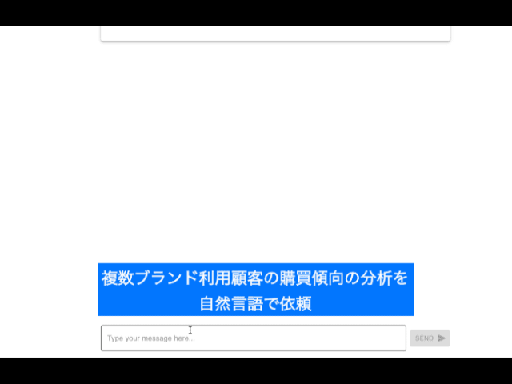

# AMT Customer 360 サンプルプロジェクト

## 概要

このプロジェクトは、AWS Entity Resolution を活用して異なるデータソース間で顧客データを照合・統合し、自然言語による対話でセグメントを作成することができる、Customer 360 を始めるためのサンプル実装です。Amazon Personalize item-affinity recipe によるセグメンテーション機能にも対応しています。

## 動作イメージ



## 想定ユースケース
デフォルトでは、メインブランドとサブブランドの 2 つの自社ECサイトを運用している事業者が持つデータを使って、ワークフローが実行されます。ワークフローでは、はじめに 2つの EC サイトで重複している顧客情報が AWS Entity Resolution の ML を用いたマッチングにより統合された後に、Amazon Personalize によってユーザーが好みそうな商品の推薦を生成します。その後、チャットインターフェイスを通じてセグメンテーション（条件に合致するユーザーの抽出）や、属性・購買行動の分析を行うことができます。例えば、以下のような質問文を与えると、分析結果を得られます。
* “メインブランドとサブブランドの両方で2回以上購買経験がある顧客がメインブランドで買っている商品のトップ3をおしえて”
* “その3つのアイテムいずれかを購入しそうな顧客のリストをください。ただし、すでに購入した実績のある顧客は除外して“
* “顧客のリストをCSVで出力して”


## ソリューションが提供する価値
デジタルやリアル店舗、自社データと他社データなど、ブランドと顧客のタッチポイントから得られるデータは多様化しています。不揃いなデータを統合すること、また膨大なデータからインサイトを得ることは、より良い顧客体験創出のために重要であることは理解されつつも、取り組めていないという企業も多数存在します。このサンプルソリューションでは、データ、システム、組織の課題に対して解決策を提供し、企業がデータを活用して顧客体験を向上させる取り組みを後押しします。


## Architecture


## デプロイオプション

下記のデプロイオプションが設定可能です。[cdk.json](./cdk.json) を開き、それぞれをtrue/falseで設定してください。

- AWS Entity Resolution を利用するかどうか: entityResolutionEnabled
- Amazon Personalize を利用するかどうか: personalizeEnabled なお、entityResolutionEnabled が true の場合のみ利用可能です


## デプロイ方法

1. クレデンシャルの設定

AWS のクレデンシャルを作業ターミナルで設定してください

2. Bedrock モデルアクセス許可

[AWS マネジメントコンソール](https://us-east-1.console.aws.amazon.com/bedrock/home?region=us-east-1#/modelaccess)から、Anthropic Claude 3.7 Sonnet を有効化してください （リージョン us-east-1, us-east-2, us-west-2 全てで行ってください)

3. 依存関係をインストール
```bash
npm ci
```

4. CDK bootstrap（初回のみ）
```bash
npm run cdk bootstrap
```

5. デプロイ実行
```bash
npm run cdk -- deploy --all
```

6. 完了

完了時、表示される Outputs から下記二つの値をメモしてください
- `AmtC360MarketingStack.DataStorageDataBucketOutput`
- `AmtC360MarketingStack.WebAppUrl`


## テストデータ準備

1. テストデータ生成

下記のようにスクリプトを実行し、テスト用CSVを作成してください

```bash
python dbloader/gen_testdata.py
```

2. テストデータアップロードスクリプト編集

`dbloader/upload_to_s3.py` をテキストエディタで開き、S3_BUCKET_NAME 変数に、デプロイ時にメモしたバケット名を設定してください

3. テストデータアップロード

アップロードを実行してください

```bash 
python dbloader/upload_to_s3.py
```

4. データ統合ワークフロー実行

AWS Entity Resolution / Amazon Personalize によるデータ統合ワークフローを実行します。
[AWS Step Functions のマネジメントコンソール](https://ap-northeast-1.console.aws.amazon.com/states/home?region=ap-northeast-1#/statemachines)を開いて `DataIntegrationWorkflow`で始まる StateMachine を実行してください


## ユーザ作成

Amazon Cognito User Pool でユーザを作成します。
[マネジメントコンソール](https://ap-northeast-1.console.aws.amazon.com/cognito/v2/idp/user-pools?region=ap-northeast-1) から、ユーザを作成してください。

以上で準備が完了です。
デプロイ時にメモした `AmtC360MarketingStack.WebAppUrl`のURLにブラウザからアクセスしてください


## Workshop

`workshop/` ディレクトリには、本ソリューションのデプロイからカスタマイズまでを段階的に進めるためのワークショップ資材が含まれています。各ディレクトリは Kiro Power として提供されており、Kiro に指示することで対話的に進められます。

| ディレクトリ | 内容 | 概要 |
|-------------|------|------|
| `1-deploy` | デプロイ | CDK デプロイ、Cognito ユーザー作成、テストデータ生成・アップロードを自動化 |
| `2-ai-bpr` | AI BPR ワークショップ | AI Driven Business Process Re-engineering。業務プロセスの分析から AI エージェントのプロトタイプ実装までを実施 |
| `3-customize` | カスタマイズ | AI BPR の成果物をもとに、CSV データの Glue Catalog 登録やエージェント設定の更新を実行 |

### 進め方

1. `1-deploy` — Kiro で「C360 をデプロイして」と指示し、環境を構築
2. `2-ai-bpr` — ワークショップ本編。`prompts/` 配下のプロンプトを順に Kiro に渡して進行
3. `3-customize` — Kiro で「C360 をカスタマイズして」と指示し、AI BPR の成果を環境に反映

各 Power の詳細は、それぞれのディレクトリ内の `POWER.md` / `README.md` を参照してください。


## 自社データに合わせたシステムカスタマイズ

自社で保有するCSVデータのスキーマに合わせてシステムをカスタマイズしたい場合は、`csvtool/`ディレクトリのツールを使用してください。


### セットアップ

1. csvtoolディレクトリに移動
```bash
cd csvtool
```

2. 依存関係をインストール
```bash
pip install -r requirements.txt
```

3. 設定ファイルを編集
`csv_to_glue_catalog.py`の冒頭で以下の変数を設定：
```python
S3_BUCKET_NAME = "<デプロイ時にメモしたDataBucketOutput>"
GLUE_DATABASE_NAME = "<実際のGlueデータベース名>"
```

4. CSVファイルを配置
`./csvfiles`ディレクトリを作成し、ヘッダー付きのCSVファイルを配置

### 実行

```bash
python csv_to_glue_catalog.py
```

### 動作内容
- 既存のGlue Catalogテーブルを削除
- CSVファイルをヘッダーでグループ化
- Amazon Bedrockでスキーマを自動分析・推測
- AWS Glue Catalogにテーブルを作成
- S3にCSVファイルをアップロード

このツールにより、自社のCSVデータを簡単にCustomer 360システムに統合できます。


## Workshop

`workshop/` ディレクトリには、Kiro Power を活用したワークショップ用のリソースが含まれています。各ステップは順番に実行してください。

| ディレクトリ | 内容 | 概要 |
|-------------|------|------|
| `1-deploy` | デプロイ | CDK デプロイ、Cognito ユーザー作成、テストデータ生成・アップロードを自動化する Power |
| `2-ai-bpr` | AI BPR ワークショップ | AI Driven Business Process Re-engineering。業務プロセスへの AI エージェント組込みを検討するワークショップ |
| `3-customize` | カスタマイズ | AI BPR の成果物をもとに、CSV の Glue Catalog 登録やエージェント指示・UI タイトルの更新を行う Power |

### 使い方

1. Kiro で本リポジトリを開く
2. 各 `workshop/` サブディレクトリの Power をインストールする
3. `1-deploy` → `2-ai-bpr` → `3-customize` の順にチャットから指示して実行する