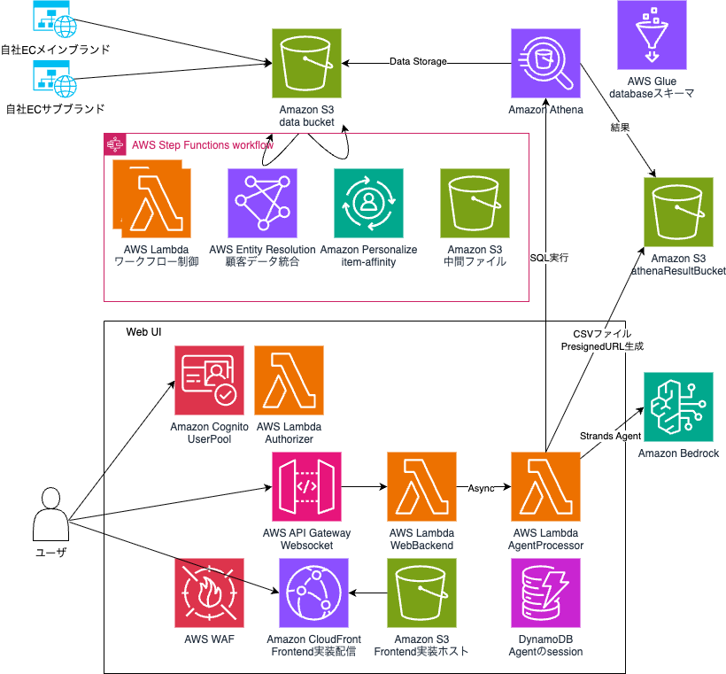

# AMT Customer 360 サンプルプロジェクト

## 概要

このプロジェクトは、AWS Entity Resolution を活用して異なるデータソース間で顧客データを照合・統合し、自然言語による対話でセグメントを作成することができる、Customer 360 を始めるためのサンプル実装です。
Amazon Personalize item-affinity recipe によるセグメンテーション機能にも対応しています


## Architecture




## デプロイ方法


1. クレデンシャルの設定

AWS のクレデンシャルを作業ターミナルで設定してください

2. Bedrock モデルアクセス許可

[AWS マネジメントコンソール](https://us-east-1.console.aws.amazon.com/bedrock/home?region=us-east-1#/modelaccess)から、Anthropic Claude 3.7 Sonnet を有効化してください （リージョン us-east-1, us-east-2, us-west-2 全てで行ってください)

3. 依存関係をインストール
```bash
npm ci
```

4. CDK bootstrap（初回のみ）
```bash
npm run cdk bootstrap
```

5. デプロイ実行
```bash
npm run cdk -- deploy --all
```

6. 完了

完了時、表示される Outputs から下記二つの値をメモしてください
- `AmtC360MarketingStack.DataStorageDataBucketOutput`
- `AmtC360MarketingStack.WebAppUrl`


## テストデータ準備

1. テストデータ生成

下記のようにスクリプトを実行し、テスト用CSVを作成してください

```bash
python dbloader/gen_testdata.py
```

2. テストデータアップロードスクリプト編集

`dbloader/upload_to_s3.py` をテキストエディタで開き、S3_BUCKET_NAME 変数に、デプロイ時にメモしたバケット名を設定してください

3. テストデータアップロード

アップロードを実行してください

```bash 
python dbloader/upload_to_s3.py
```

4. データ統合ワークフロー実行

AWS Entity Resolution / Amazon Personalize によるデータ統合ワークフローを実行します。
[AWS Step Functions のマネジメントコンソール](https://ap-northeast-1.console.aws.amazon.com/states/home?region=ap-northeast-1#/statemachines)を開いて `DataIntegrationWorkflow`で始まる StateMachine を実行してください


## ユーザ作成

Amazon Cognito User Pool でユーザを作成します。
[マネジメントコンソール](https://ap-northeast-1.console.aws.amazon.com/cognito/v2/idp/user-pools?region=ap-northeast-1) から、ユーザを作成してください。

以上で準備が完了です。
デプロイ時にメモした `AmtC360MarketingStack.WebAppUrl`のURLにブラウザからアクセスしてください