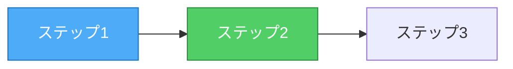
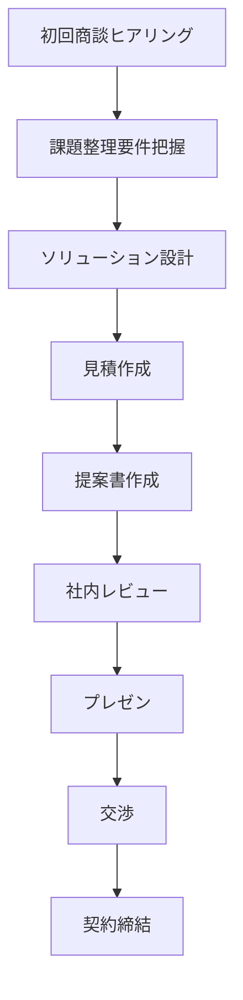
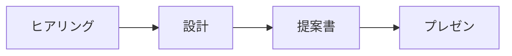

# Slidev プレゼンテーションのベストプラクティス

このスキルは、Slidevを使用した効果的なプレゼンテーションスライドの作成方法をまとめたものです。

---

## このスキルの使い方

### いつ使うか

ユーザーから以下のような指示を受けた場合にこのスキルを参照してください:

- 「スライドを作成して」
- 「プレゼン資料を作って」
- 「〇〇をスライドにまとめて」
- 「スライドを改善して」
- 「スライドが見づらい」

### 何を提供するか

このスキルは以下を提供します:

1. **スライド作成の基本原則**: タイトル=メッセージ、3つのポイント、強調、So What?
2. **スライドタイプ別のテンプレート**: Agenda、問題提起、ソリューション、比較、結果、まとめ等
3. **レイアウト・デザインの原則**: グリッド、余白、色、表、Mermaid図
4. **よくある失敗と改善方法**: 情報過多、図の複雑さ、余白不足等
5. **チェックリスト**: スライド完成後の確認項目

### 使い方の例

```
ユーザー: 「プロジェクトの成果をスライドにまとめて」

あなた: 
1. slidev-best-practices.mdを参照
2. Agendaスライドでストーリーラインを設計
3. 各スライドを「タイトル=メッセージ、Body=根拠」の構造で作成
4. 3つのポイントに絞り、重要な数値を太字で強調
5. So What?を最下段に追加
6. Mermaid図は横向き（LR）、4〜5ステップに絞る
7. チェックリストで確認
```

---

## 1. スライド作成の基本原則

### 1.1 スライド構成の基本

各スライドは以下の構造を持つべきです:

```
タイトル = メッセージ（主張・結論）
Body = 根拠・データ・図解
```

#### 良い例
```markdown
# 失注の30%は「提案が顧客課題に合致しない」

現状の営業プロセスでは、ヒアリング品質のばらつきが成約率を低下させている

- 提案書作成に平均2週間、成約率15%
- 上位営業と下位営業で成約率が3倍の差（25% vs 8%）
```

#### 悪い例
```markdown
# プロジェクトの背景と目標

## 現状の課題
- 提案書作成に平均2週間
- 成約率15%（業界平均以下）
...（情報が多すぎる）
```

### 1.2 情報量の原則

- **1スライド1メッセージ**: 伝えたいことを1つに絞る
- **3つのポイント**: メッセージを支える根拠は3つに絞る（最大5つ）
- **視覚的余白**: スライドの30%以上は余白を確保
- **文字数制限**: 1スライドあたり100〜150文字程度

### 1.3 強調の原則

**タイトルのメッセージとアラインするデータや根拠は強調する**

```markdown
# 失注の30%は「提案が顧客課題に合致しない」

- 提案書作成に平均2週間、成約率**15%**
- 上位営業と下位営業で成約率が**3倍の差**（25% vs 8%）
- 失注理由の**30%**が「提案内容が顧客課題に合致しない」
```

**強調方法**:
- 太字（`**数値**`）: 重要な数値、パーセンテージ
- 色（表のセル内など）: 目標値、改善値
- フォントサイズ: So What?メッセージ

### 1.4 So What?の明示

**スライドの最下段に、大きめのフォントでSo What?を追加**

```markdown
<div class="text-xl mt-8">
→ ヒアリング品質の均質化が成約率向上の鍵
</div>
```

**効果**:
- スライドの結論を明確化
- 聴衆の理解を促進
- 次のスライドへの橋渡し

### 1.5 スライド枚数の目安

プレゼンテーション時間に応じた枚数:
- 5分: 5〜7枚
- 10分: 10〜12枚
- 20分: 15〜20枚
- 30分: 20〜25枚

**重要**: 情報を詰め込むのではなく、枚数を増やして1枚あたりの情報量を減らす

---

## 2. スライドタイプ別のパターン

### 2.1 カバースライド

```markdown
---
layout: cover
---

# プロジェクト名

サブタイトル（1行で簡潔に）

<div class="absolute bottom-10">
  <span class="font-700">
    発表者名 | 日付
  </span>
</div>
```

### 2.2 Agendaスライド

```markdown
---

# Agenda

本日のストーリーライン

<div class="mt-8">

1. **現状の課題**: [課題を1行で]

2. **分析**: [分析結果を1行で]

3. **ソリューション**: [ソリューションを1行で]

4. **効果**: [効果を1行で]

5. **実現可能性**: [実現可能性を1行で]

6. **次のステップ**: [次のステップを1行で]

</div>
```

**原則**:
- 各項目は1行で簡潔に
- 太字でセクション名を強調
- 6〜8項目程度（多すぎない）
- ストーリーの流れが論理的か確認

### 2.3 メッセージスライド（問題提起）

```markdown
---

# [問題を端的に表現]

[問題の説明を1〜2行で]

- 根拠1（数値やデータ、**重要な数値は太字**）
- 根拠2（数値やデータ、**重要な数値は太字**）
- 根拠3（数値やデータ、**重要な数値は太字**）

<div class="text-xl mt-8">
→ So What?（結論や示唆）
</div>
```

### 2.4 ソリューションスライド

```markdown
---

# [ソリューションの効果を端的に表現]

[ソリューションの説明を1〜2行で]

<div class="grid grid-cols-2 gap-4 mt-4">

<div>

### 3つの主要機能
1. 機能1
2. 機能2
3. 機能3

</div>

<div>

### 期待効果

| 指標 | 現状 | 目標 |
|------|------|------|
| 指標1 | 値1 | **値2** |
| 指標2 | 値1 | **値2** |

</div>

</div>

<div class="text-xl mt-8">
→ So What?（効果の要約）
</div>
```

### 2.5 比較スライド（Before/After）

```markdown
---

# [変化を端的に表現]

[変化の説明を1行で]

<div class="grid grid-cols-2 gap-4 mt-4">

<div>

### Before（現状値）

[図解またはリスト]

[問題点を1行で]

</div>

<div>

### After（目標値）

[図解またはリスト]

[改善点を1行で]

</div>

</div>
```

### 2.6 データ・結果スライド

```markdown
---

# [結果を端的に表現]

[結果の説明を1〜2行で]

<div class="grid grid-cols-2 gap-4 mt-4">

<div>

### カテゴリ1

✅ 成功項目
- 詳細1

⚠️ 課題項目
- 詳細2

</div>

<div>

### カテゴリ2

✅ 成功項目
- 詳細1

⚠️ 課題項目
- 詳細2

</div>

</div>
```

### 2.7 まとめスライド

```markdown
---

# [プロジェクト全体の成果を端的に表現]

[成果の説明を1行で]

<div class="grid grid-cols-2 gap-4 mt-4">

<div>

### 達成したこと
- 項目1
- 項目2
- 項目3

### 主要な成果

| 指標 | 現状 | 目標 |
|------|------|------|

</div>

<div>

### ROI
- 投資: XX万円
- 効果: **XX万円**
- 回収期間: **Xヶ月**

### 次のステップ
1. ステップ1
2. ステップ2
3. ステップ3

</div>

</div>

<div class="text-xl mt-8">
→ So What?（全体の結論）
</div>
```

**次のステップスライドの原則**:
- 主要なステークホルダーと役割を明示
- 体制（プロジェクトオーナー、コアメンバー、参加者）
- スケジュール（フェーズと期間）
- 3つの要素を明確に

### 2.8 結論スライド

```markdown
---

# 結論

<div class="mt-16 text-center">

## [プロジェクトの結論を1行で]

<div class="mt-12 text-2xl">

1. キーメッセージ1

2. キーメッセージ2

3. キーメッセージ3

</div>

</div>
```

**原則**:
- キーメッセージは最大3つ
- 中央寄せで視覚的にインパクト
- 長々と書かない（1行で簡潔に）
- 数値や効果を含める

### 2.9 エンドスライド

```markdown
---
layout: end
---

# ありがとうございました

<div class="mt-8 text-center">

次のアクション: アクション1 → アクション2 → アクション3

</div>

<div class="absolute bottom-10 w-full text-center">
  <span class="font-700">
    質問・ディスカッション
  </span>
</div>
```

---

## 3. レイアウト・デザインの原則

### 3.1 グリッドレイアウトの活用

Slidevでは`grid`クラスを使用して情報を整理:

```markdown
<div class="grid grid-cols-2 gap-4">
  <!-- 2カラムレイアウト -->
</div>

<div class="grid grid-cols-3 gap-4">
  <!-- 3カラムレイアウト -->
</div>
```

**使い分け**:
- 2カラム: 比較、Before/After、カテゴリ別整理
- 3カラム: 3つの要素を並列に提示（効率化・品質・コスト等）

### 3.2 余白の確保

```markdown
<div class="mt-4">  <!-- 上部マージン -->
<div class="mb-4">  <!-- 下部マージン -->
<div class="mt-8">  <!-- 大きめの上部マージン -->
```

**原則**:
- セクション間: `mt-4`（16px）
- 大きな区切り: `mt-8`（32px）
- タイトルとBodyの間: 自動で確保されるため不要

### 3.3 テキストサイズの階層

```markdown
# タイトル（最大）
### サブタイトル（中）
通常テキスト（標準）
<div class="text-sm">小さいテキスト</div>
```

**使い分け**:
- `#`: スライドタイトル（メッセージ）
- `###`: セクション見出し
- 通常: 本文、リスト
- `text-sm`: 補足情報、注釈

### 3.4 色と強調の使い方

**太字による強調**:
```markdown
- 成約率**15%**
- 成約率が**3倍の差**
- 失注理由の**30%**
```

**表内の強調**:
```markdown
| 指標 | 現状 | 目標 |
|------|------|------|
| 成約率 | 15% | **20%** |
```

**原則**:
- タイトルのメッセージとアラインする数値を太字に
- 目標値、改善値を強調
- 1スライドで強調する箇所は3〜5箇所まで

**色の使い方**:

Slidevのデフォルトテーマでは色を控えめに使用:

```markdown
<div class="text-red-500">警告・問題</div>
<div class="text-green-500">成功・改善</div>
<div class="text-blue-500">情報・中立</div>
```

**原則**:
- 色は意味を持たせる（装飾目的で使わない）
- 1スライドに使う色は2〜3色まで
- 背景色は使わない（余白で区切る）

### 3.5 So What?の表示

```markdown
<div class="text-xl mt-8">
→ ヒアリング品質の均質化が成約率向上の鍵
</div>
```

**原則**:
- スライドの最下段に配置（`mt-8`で上部マージン）
- フォントサイズを大きく（`text-xl`）
- 矢印（→）で視覚的に強調
- 1行で簡潔に

### 3.6 アイコン・記号の活用

```markdown
✅ 成功・達成
⚠️ 課題・注意
❌ 失敗・不可
→ 変化・移行
```

**効果**:
- 視覚的に情報を区別
- 文字数を削減
- 読みやすさ向上

### 3.6 表の使い方

```markdown
| 項目 | 現状 | 目標 | 改善 |
|------|------|------|------|
| 指標1 | 値1 | 値2 | +XX% |
| 指標2 | 値1 | 値2 | +XX% |
```

**原則**:
- 列数は4列まで
- 行数は5行まで
- ヘッダーは必須
- 数値は右揃え（自動）

### 3.7 Mermaid図の原則

**重要**: Mermaid図は横向き（LR）を基本とし、4〜5ステップに絞る

```markdown

```

**原則**:
- **方向**: `graph LR`（左から右）を使用。`graph TB`（上から下）は避ける
- **ノード数**: 4〜5個まで（最大でも7個）
- **ラベル**: 短く（2〜3単語）、改行は`<br/>`で
- **色**: 意味を区別（人間/AI、Before/After、フォーカス/対象外等）
- **複雑な図**: 分割して複数スライドに

**悪い例（縦向き、ノード多すぎ）**:
```markdown

```
→ スライドから縦にはみ出る、情報過多

**良い例（横向き、キープロセスのみ）**:
```markdown

```
→ スライドに収まる、重要なプロセスに焦点

---

## 4. よくある失敗と改善方法

### 4.1 情報過多

**失敗例**:
```markdown
# プロジェクトの背景と目標

<div class="grid grid-cols-2 gap-4">
<div>
## 現状の課題
- 提案書作成に平均2週間
- 成約率15%（業界平均以下）
- ヒアリング品質のばらつき
- ナレッジの属人化
...（さらに続く）
</div>
<div>
## プロダクトゴール
...（長文）
### 3つのObjective
...（さらに続く）
</div>
</div>
```

**改善方法**: 2〜3枚のスライドに分割
1. 問題提起スライド
2. 目標スライド
3. アプローチスライド

### 4.2 タイトルが説明的

**失敗例**:
```markdown
# プロジェクトの背景と目標
# デモシナリオと評価
# 総合評価: 有効性
```

**改善例**:
```markdown
# 失注の30%は「提案が顧客課題に合致しない」
# デモで有効性を確認：質問サジェストと構造化が機能
# 成約率15→25%向上、年間5550万円の効果を見込む
```

### 4.3 図が複雑すぎる・縦にはみ出る

**失敗例**: 
- 縦向き（TB）の図で7個以上のノード
- 詳細すぎるラベル

```markdown
```mermaid
graph TB
    A[初回商談ヒアリング] --> B[課題整理要件把握]
    B --> C[ソリューション設計]
    ...（さらに続く）
```
```

**改善方法**:
- **横向き（LR）に変更**: `graph LR`を使用
- **キープロセスに絞る**: 4〜5ステップのみ表示
- **ラベルを短縮**: 「初回商談ヒアリング」→「ヒアリング」
- **詳細は別スライド**: 必要なら詳細図を別スライドに

**改善例**:
```markdown

```

### 4.4 余白がない

**失敗例**: スライド全体にテキストが詰まっている

**改善方法**:
- `mt-4`、`gap-4`で余白を追加
- 情報を削減（80%ルール: 20%は削除できる）
- 複数スライドに分割

---

## 5. チェックリスト

スライド作成後、以下を確認:

### 内容
- [ ] Agendaスライドでストーリーラインが明確か？
- [ ] 各スライドのタイトルは明確なメッセージか？
- [ ] 1スライド1メッセージになっているか？
- [ ] 根拠・データは3つに絞られているか？
- [ ] タイトルとアラインする数値は太字で強調されているか？
- [ ] So What?が最下段に明示されているか？
- [ ] 専門用語は最小限か？

### レイアウト
- [ ] 余白は十分か（30%以上）？
- [ ] 文字数は適切か（100〜150文字）？
- [ ] 表の列数・行数は適切か（4列×5行以内）？
- [ ] Mermaid図は横向き（LR）か？
- [ ] Mermaid図のノード数は適切か（4〜5個、最大7個）？

### デザイン
- [ ] 色は意味を持って使われているか？
- [ ] アイコン・記号で視認性を高めているか？
- [ ] グリッドレイアウトで情報が整理されているか？
- [ ] テキストサイズの階層は適切か？

### 全体
- [ ] スライド枚数は時間に対して適切か？
- [ ] ストーリーの流れは論理的か？
- [ ] 重複する情報はないか？

---

## 6. Slidev固有のTips

### 6.1 レイアウトの指定

```markdown
---
layout: cover  # カバーページ
---

---
layout: default  # 通常ページ（デフォルト）
---

---
layout: end  # エンドページ
---
```

### 6.2 スライド区切り

```markdown
---
# 新しいスライドの開始
```

3つのハイフン（`---`）で区切る

### 6.3 クラスの活用

```markdown
<div class="grid grid-cols-2 gap-4 mt-4">
  <!-- グリッドレイアウト -->
</div>

<div class="text-sm">
  <!-- 小さいテキスト -->
</div>

<div class="absolute bottom-10">
  <!-- 絶対配置（フッター等） -->
</div>
```

### 6.4 Mermaidのスタイリングと方向

**方向の指定**:
```markdown
```mermaid
graph LR  # 左から右（推奨）
graph TB  # 上から下（避ける）
```
```

**スタイリング**:
```markdown

```

よく使う色:
- 青系（人間、フォーカス）: `fill:#4dabf7,stroke:#1971c2,color:#fff`
- 緑系（AI、改善後）: `fill:#51cf66,stroke:#2b8a3e,color:#fff`
- 赤系（問題、改善前）: `fill:#ff6b6b,stroke:#c92a2a,color:#fff`
- グレー系（対象外）: `fill:#e9ecef,stroke:#adb5bd,color:#495057`

---

## 7. 実践例

このスキルを適用した実例: `ai-bpr-slides/slides.md`

主な改善点:
1. Agendaスライドを追加してストーリーラインを明確化
2. タイトルをメッセージ化（「プロジェクトの背景」→「失注の30%は課題不一致」）
3. 情報量を削減（各スライドを3つのポイントに絞る）
4. 重要な数値を太字で強調（**15%**、**3倍の差**等）
5. So What?を最下段に追加（`text-xl`で大きく表示）
6. Mermaid図を横向き（LR）に変更し、4〜5ステップに絞る
7. グリッドレイアウトで整理（2カラムを基本）
8. 余白を確保（`mt-4`、`gap-4`、`mt-8`を活用）
9. 次のステップに体制とスケジュールを明示
10. 結論スライドは3つのキーメッセージで簡潔に

---

## 8. 参考資料

- Slidev公式ドキュメント: https://sli.dev/
- Tailwind CSSクラス: https://tailwindcss.com/docs
- Mermaid記法: https://mermaid.js.org/

---

このスキルは、AI-BPRプロジェクトのスライド作成経験から抽出したベストプラクティスです。
プロジェクトの性質に応じて適宜調整してください。
