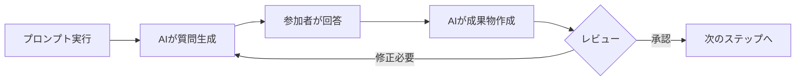

# AI BPR (AI Driven Business Process Re-engineering)

## AI BPR とは

AI BPR は、お客様の持続的なビジネス成長のため AI エージェントを業務プロセスに組み込むためのプログラムです。従来の Business Process Re-engineering、BPR では企画部やコンサルタントが業務エキスパートにヒアリングして、いったん持ち帰り成果物を作ってから再度確認し・・・という手間がかかりました。分析だけで長期間にわたることも多く、分析が終わったころには担当者が変わり解決策の検討、実装に至らないこともしばしばありました。 AI BPR は 「制約設計 × 生成AI委譲」モデルを採用することで、人間は目標や制約についての意思決定にフォーカスし、"AI Driven" に成果物を作成することで「持ち帰り」時間を極小化します。これにより、従来では考えられないスピードで検討を進め AI エージェントのビジネスモデルへの組込みを可能にします。

| 観点 | 従来のBPR | AI BPR |
|------|-----------|--------|
| 人間の役割 | 現状を分析し、改善案を考え、評価し、実装する | 評価基準と制約を設計し、最良の改善案を選ぶ |
| AIの役割 | 現状分析・資料作成の補助 | 制約内で様々な改善案の作成・自己評価 |
| 意思決定まで | 数ヶ月 | **数時間〜数日** |
| 実現可能性の担保 | 改善案が決まった後に評価 | 制約で決められた範囲で実現可能なAIエージェントを前提にする |
| アウトプット | 議事録・変革案 | 変革案、実装デモ、デモによる評価 |

## なぜ AWS は AI BPR を発明したか

### Why Now?

特に日本のお客様は、生産年齢人口が減少する一方で、海外に比べ DX を牽引できる人材が 2~3 倍少ない課題に直面しています。2025 年 10 月時点で正社員が不足している企業は 51.6% 、IT 系企業では 67.7% が不足と回答しています。

このような状況で、「今まで通りの採用」を前提としたビジネスモデルはもはや持続的ではありません。さらに拡大を目指していくならば、いままで 10 人は必要だったチームが 3 人、7 人分は AI エージェントを「採用」するという考え方に根本的に切り替える必要があります。

### What's Customer's Problem?

すでに生成 AI のツールは導入しており個人業務での生成 AI 活用の度合いは 62.1% に登るものの業務プロセスへの組込みは 13.1% で米国・ドイツの 37% に比べ大きな差がある。

業務全体での生成 AI 活用も検討しているものの、組織間の壁や As-is の分析に時間やコンサルティング費用がかかり始められないか本題に入ることができていない。

### How We Solve?

AI BPR では、従来の現状分析から入り人間が改善案を考えるプロセスとは全く異なるアプローチをとります。人間はビジネスモデルのアウトカム評価と制約条件の設計に集中し、不確実性が高く本数が必要な改善案（AIエージェント採用案）の探索は生成AIに委譲します。

#### 3つの革新的プロセス

1. **制約駆動デザイン**: 人間は評価基準(OKR)と制約条件(予算・期間・人員・KPI)の設計に専念します。生成AIは制約内で実現可能な複数の改善案を生成し、人間は最良案を「選ぶ」ことに集中できます。従来のように改善案を考える必要はありません。

2. **ステークホルダーシミュレーション**: 実データとペルソナに基づき、各ステークホルダーの視点で改善案を評価する会議をAIがシミュレーションします。利用者・採用意思決定者・運用担当者それぞれの懸念点が事前に可視化され、根拠あるフィードバックが得られます。

3. **即座に動くプロトタイプ**: Kiro Power を用いて、デモシナリオに沿った AI エージェントを即座に実装します。MCP サーバーとの連携により外部システムとの統合も含めた動作確認が可能で、効果を体験しながら検証できます。

## AI BPR の進め方

### 前提条件

- Kiro または Amazon Q Developer のサブスクリプション登録済み
- 対象業務プロセスについて価値判断できるメンバー（業務エキスパート、開発者、事業責任者）の参加
- カスタマーレビューやフィードバックデータ

### 所要時間

最低3時間（Introduction 15分、Warm-up 15分、Workshop本編2時間）。初回は余裕を持って3.5〜4時間推奨。

### ワークショップの進め方

各ステップは以下のサイクルで進行します:

使用するプロンプト:
- `prompts/01_goal.md` - プロダクトゴールとOKRの設定
- `prompts/02_focus.md` - フォーカス領域とボトルネックの特定
- `prompts/03_solution.md` - AIエージェント前提のソリューションデザイン
- `prompts/04_demo.md` - 動作するプロトタイプの実装

各プロンプトをKiroに渡すと、AIが作業計画を立て、必要な情報を質問形式で確認します。参加者は質問に回答し、AIはその回答をもとに成果物を作成します。成果物をレビューし、必要に応じて修正を繰り返しながら次のステップに進みます。

* `data/` ディレクトリに配置したデータは Markdown 化して検索可能にし、質問に対する回答が得られるようであればそこから回答します

### ワークショップの流れ

| Step | 内容 | 所要時間 |
|------|------|----------|
| Introduction | AI BPR が必要な背景の共有、トーンセット | 15分 |
| Warm-up | 動作環境確認、Kiro のコンセプトと使い方の説明 | 15分 |
| Step 1: Goal | プロダクトゴール設定 — OKR文書作成、ステークホルダー特定、採用決定基準の明確化 | 30分 |
| Step 2: Focus | プロダクトフォーカス特定 — 業務範囲の可視化、ボトルネック特定、制約条件設定 | 30分 |
| Step 3: Solution | プロダクトデザイン — AIエージェント前提の体験設計、複数案生成・評価、FAQ作成 | 40分 |
| Step 4: Demo | プロトタイピング — デモシナリオ作成、Kiro Power による AI エージェント実装、効果検証 | 30分 |
| Step 5: Review | 振り返りと次のアクション — パイロット計画、タイムライン決定 | 20分 |
| Closing | アンケートなど | 10分 |

