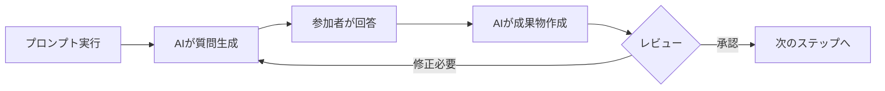

# AI BPR (AI Driven Business Process Re-engineering)

## AI BPR とは

AI BPR は、お客様の持続的なビジネス成長のため AI エージェントを業務プロセスに組み込むためのプログラムです。従来の Business Process Re-engineering、BPR では企画部やコンサルタントが業務エキスパートにヒアリングして、いったん持ち帰り成果物を作ってから再度確認し・・・という手間がかかりました。分析だけで長期間にわたることも多く、分析が終わったころには担当者が変わり解決策の検討、実装に至らないこともしばしばありました。 AI BPR は 「制約設計 × 生成AI委譲」モデルを採用することで、人間は目標や制約についての意思決定にフォーカスし、"AI Driven" に成果物を作成することで「持ち帰り」時間を極小化します。これにより、従来では考えられないスピードで検討を進め AI エージェントのビジネスモデルへの組込みを可能にします。

| 観点 | 従来のBPR | AI BPR |
|------|-----------|--------|
| 人間の役割 | 現状を分析し、改善案を考え、評価し、実装する | 評価基準と制約を設計し、最良の改善案を選ぶ |
| AIの役割 | 現状分析・資料作成の補助 | 制約内で様々な改善案の作成・自己評価 |
| 意思決定まで | 数ヶ月 | **数時間〜数日** |
| 実現可能性の担保 | 改善案が決まった後に評価 | 制約で決められた範囲で実現可能なAIエージェントを前提にする |
| アウトプット | 議事録・変革案 | 変革案、実装デモ、デモによる評価 |

## なぜ AWS は AI BPR を発明したか

### Why Now?

特に日本のお客様は、生産年齢人口が減少する一方で、海外に比べ DX を牽引できる人材が 2~3 倍少ない課題に直面しています。2025 年 10 月時点で正社員が不足している企業は 51.6% 、IT 系企業では 67.7% が不足と回答しています。

このような状況で、「今まで通りの採用」を前提としたビジネスモデルはもはや持続的ではありません。さらに拡大を目指していくならば、いままで 10 人は必要だったチームが 3 人、7 人分は AI エージェントを「採用」するという考え方に根本的に切り替える必要があります。

### What's Customer's Problem?

すでに生成 AI のツールは導入しており個人業務での生成 AI 活用の度合いは 62.1% に登るものの業務プロセスへの組込みは 13.1% で米国・ドイツの 37% に比べ大きな差がある。

業務全体での生成 AI 活用も検討しているものの、組織間の壁や As-is の分析に時間やコンサルティング費用がかかり始められないか本題に入ることができていない。

### How We Solve?

AI BPR では、従来の現状分析から入り人間が改善案を考えるプロセスとは全く異なるアプローチをとります。人間はビジネスモデルのアウトカム評価と制約条件の設計に集中し、不確実性が高く本数が必要な改善案（AIエージェント採用案）の探索は生成AIに委譲します。

#### 3つの革新的プロセス

1. **制約駆動**: 人間はありたい姿と制約の検討に専念します。評価基準(OKR)と制約条件(予算・期間・人員・KPI)を設計し、実現方法の検討は AI に委譲します。生成AIは制約内で実現可能な複数の改善案を生成し、人間は最良案を「選ぶ」ことに集中できます。

2. **仮説駆動**: 生成 AI により素早くデモを構築し、得られる効果を予測します。Kiro Power を用いてデモシナリオに沿った AI エージェントを即座に実装し、MCP サーバーとの連携により外部システムとの統合も含めた動作確認が可能で、実際得られる効果を予測します。

3. **摩擦前提**: BPR に際して摩擦が発生することを前提とし、解決の場づくりを提案します。便利なツールがあれば自然と仕事の仕方が変わるという楽観的な前提ではなく、機能と人による「摩擦の解決」を前提とした計画を作成します。

## AI BPR の進め方

### 前提条件

- Kiro または Amazon Q Developer のサブスクリプション登録済み
- 対象業務プロセスについて価値判断できるメンバー（業務エキスパート、開発者、事業責任者）の参加
- カスタマーレビューやフィードバックデータ

### 所要時間

最低3時間（Introduction 15分、Warm-up 15分、Workshop本編2時間）。初回は余裕を持って3.5〜4時間推奨。

### ワークショップの進め方

各ステップは以下のサイクルで進行します。

```mermaid
graph LR
    A[プロンプト実行] --> B[AIが質問生成]
    B --> C[参加者が回答]
    C --> D[AIが成果物作成]
    D --> E{レビュー}
    E -->|修正必要| B
    E -->|承認| F[次のステップへ]
```

使用するプロンプト
- `prompts/01_goal.md` - プロダクトゴールとOKRの設定
- `prompts/02_focus.md` - フォーカス領域とボトルネックの特定
- `prompts/03_solution.md` - AIエージェント前提のソリューションデザイン
- `prompts/04_simulation.md` - 動作する設計の実装
- `prompts/05_challenge.md` - 導入に際しての摩擦の特定と解決計画の策定

各プロンプトをKiroに渡すと、AIが作業計画を立て、必要な情報を質問形式で確認します。参加者は質問に回答し、AIはその回答をもとに成果物を作成します。成果物をレビューし、必要に応じて修正を繰り返しながら次のステップに進みます。

* 最初の `01_goal.md` は、プロンプトの一番下にある `あなたのタスク` に取り組みたいテーマを記載してください (既存の記載はデモ用なので消して頂いて OK です)

**ワークショップ後の実装フェーズ**: ワークショップで確定したソリューションを実装する際は、`prompts/05_challenge.md`で特定した摩擦と解決計画をもとに、段階的に導入を進めることができます。これにより、ステークホルダーの懸念を解消しながらワークショップから実装へシームレスに移行できます。

* `data/` ディレクトリに配置したデータは Markdown 化して検索可能にし、質問に対する回答が得られるようであればそこから回答します

### ワークショップの流れ

| Step | 内容 | 所要時間 |
|------|------|----------|
| Introduction | AI BPR が必要な背景の共有、トーンセット | 15分 |
| Warm-up | 動作環境確認、Kiro のコンセプトと使い方の説明 | 15分 |
| Step 1: Goal | ステークホルダー特定、採用決定基準の文書化 | 30分 |
| Step 2: Focus | 注力業務範囲の可視化とボトルネック特定、制約条件設定 | 30分 |
| Step 3: Solution | 複数案生成・評価、FAQ作成 | 30分 |
| Step 4: Simulation | シナリオ作成、Kiro Power による AI エージェント効果検証 | 30分 |
| Step 5: Challenge | 摩擦の予測と解決のスケジュール検討 | 30分 |
| Closing | アンケートなど | 10分 |

### ワークショップ後の実装フェーズ

ワークショップで確定したソリューションを実際に導入する際は、`prompts/05_challenge.md`で作成した解決計画を使用します。このプロンプトは以下を支援します:

- 導入に際して発生する摩擦（ステークホルダーの懸念、組織的障壁）の特定
- 摩擦を解決するための場づくりとアクションプランの策定
- 段階的な導入計画の作成

これにより、楽観的な前提に頼らず、摩擦の解決を織り込んだ現実的な計画でAIエージェントの本番稼働まで進めることができます。

