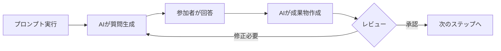

# AI BPR (AI Driven Business Process Re-engineering)

## AI BPR とは

AI BPR は、AI エージェントを業務プロセスに組み込むことで、お客様の持続的なビジネス成長を実現するプログラムです。

* 組織にとっての意味 : ビジネスモデルを AI エージェント前提に組み替え、来る人口減の未来でも持続的かつ加速度的に発展できる体制を構築する。

* 個人(従業員)にとっての意味 : 自分の仕事の中で自信と貢献が一致するプロセスを発見し、集中するための役割分担を整える。

従来の BPR には大きく 2 つの課題がありました。1 点目は、BPR を進める速度です。既存の業務プロセス理解を理解するためのヒアリング、成果物作成、確認のサイクルは 1 回で数週間かかることもあり、変化の激しい事業環境の中で進めることに課題がありました。 2 点目は、"Re-engineering" が現場の心理的安全性を脅かす点です。特に、生成 AI はその能力の高さから担当者の仕事が代替・喪失する危機感をより強くもたらし、従来の問題解決型アプローチでは現場との亀裂をより深めるリスクがあります。

AI BPR は生成 AI よる成果物作成のスピード向上と、Possibility Amplification (可能性増幅) モデルの採用により、従来では考えられないスピードで付加価値の高い業務をより強化 (Amplification) する形で AI エージェントのビジネスモデルへの組込みを可能にします。


| 観点 | 従来のBPR | AI BPR |
|------|-----------|--------|
| 出発点の問い | 「効率が悪いプロセスは?」ボトルネック特定から始まる | 「何が強みか?何が可能か ?」強みの発見から始まる |
| 人間の役割 | 現状を分析し、問題を発見し、修正する | 現状を分析し、強みを発見し、リソース配分を変える |
| AIの位置づけ | 問題を修正するツール : 人間が設計した改善案の実行を補助する | 集中を促すパートナー : 強みを可視化し、非コア業務を引き受ける |
| 参加者の心理的反応 | 防衛 : 自分の仕事が否定される | 肯定 :自分の仕事の可能性が広がる |
| 意思決定まで | 数ヶ月 | **数時間〜数日** |
| アウトプット | 議事録・変革案 | Before/After 業務フロー、AI エージェントプロトタイプ |

## AWS が AI BPR を発明した背景

### Why Now?

特に日本のお客様は、生産年齢人口が減少する一方で、海外に比べ DX を牽引できる人材が 2~3 倍少ない課題に直面しています。2025 年 10 月時点で正社員が不足している企業は 51.6% 、IT 系企業では 67.7% が不足と回答しています。このような状況で、「今まで通りの採用と育成」を前提としたビジネスモデルは持続的ではありません。

### What's Customer's Problem?

効率化を進める中で、すでに生成 AI を個人業務で利用する割合は 62.1% に登るものの業務プロセスへの組込みは 13.1% で米国・ドイツの 37% に比べ大きな差があります。この一因として、効率化と並行した出口の議論が不透明であることが挙げられます。例えば、現状 5 人で担当している業務に「問題」があり、生成 AI を使えば 3 人で良いとわかった場合の 2 人はどうなるのか、ということです。

この停滞は、複数の研究が示す 3 つの心理学的メカニズムによって構造的に説明できます。

1. **欠損への集中が防衛反応を誘発する**: Forbes が「[Deficit Reflex (欠損反射)](https://www.forbes.com/sites/vibhasratanjee/2026/02/12/the-deficit-reflex-why-change-management-keeps-solving-the-wrong-problem/)」と呼ぶ通り、組織変革は自動的に「何が壊れているか」を問うことから始まりがちです。しかしこのフレーミングは参加者に「不十分だと感じる理由」を与え、防衛反応を誘発してイニシアチブを停滞させます

2. **損失が利得より強く感じられるのに、利得 (出口) が設計されていない**: Kahneman & Tversky の[プロスペクト理論 (1979)](https://doi.org/10.2307/1914185) は、人間が同等の利得よりも損失を約 2 倍強く感じることを示しました。AI 導入は効率化という利得を提示しますが、専門性の陳腐化や雇用の不安定といった損失に対する「出口」、新しいキャリアやリスキルの機会等が設計されていません。[Stanford の研究 (2025)](https://arxiv.org/abs/2506.06576) でも、労働者の最大の懸念は「信頼の欠如」(45%) と「職の代替への恐怖」(23%) です。

3. **経営への不信がブレーキになる**: [Gallup の調査](https://www.gallup.com/cliftonstrengths/en/349763/strengths-based-approach-organizational-success.aspx)では、重要な変更の前にリーダーがフィードバックを積極的に求めていると感じる従業員はわずか 14%、変更後に自分の意見が尊重されたと感じる従業員は 16% に過ぎません。現場が「聞かれていない」と感じている状態では、どれほど合理的な変革案も受容されません。

AI BPR は、この構造的な失敗要因を克服するプログラムです。「何が壊れているか」ではなく「何がすでにうまくいっているか、そしてそれを AI でどう増幅するか」を出発点とすることで、参加者が自分の仕事の価値を再発見し、AI を脅威ではなく増幅器として認知できる文化を醸成します。

### How We Solve?

AI BPR は、従来の問題解決型 (Problem-Solving) アプローチとは根本的に異なる Possibility Amplification (可能性増幅) パラダイムを採用します。現状分析から入り人間が改善案を考えるのではなく、参加者の業務の強みを発見し、強みの増幅という「出口」に向かい AI エージェントを用いる方法を特定します。

#### 3 つの設計原則

1. **強み起点 (Strength-First)**: 「何が壊れているか」ではなく「何がうまくいっているか」から始めます。参加者の業務プロセスの中にある強み (💪) を発見し、それが顧客価値 (📦) にどう貢献しているかを可視化します。強みの肯定から始めることで、参加者の有能感を高め、AI を脅威ではなく増幅器として受け入れる心理的基盤を作ります

2. **知識蒸留 (Knowledge Distillation)**: 参加者が実際の業務データを使い、自分の暗黙知を AI エージェントに蒸留します。業務データの投入 → AI による回答・行動 → 参加者によるギャップ補正のループを通じて、AI が何をどこまでできるかを自分の目で確認し、委譲の判断根拠を自ら獲得します

3. **オーナーシップ設計 (Ownership Design)**: ワークショップは「引き受ける (Own)」で終わります。Before/After の比較、具体的な意向スケジュール、各ステークホルダーのオーナーシップ宣言を通じて、変革を「やらされること」ではなく「自分のもの」として引き受ける構造を作ります


## AI BPR の進め方

### 前提条件

- Kiro または Amazon Q Developer のサブスクリプション登録済み
- 対象業務プロセスについて価値判断できるメンバー（業務エキスパート、開発者、事業責任者）の参加
- カスタマーレビューやフィードバックデータ

### 所要時間

4 時間（Introduction 15分、Warm-up 15分、Workshop 本編 3 時間 20 分、Closing 10 分）。

### ワークショップの進め方

各ステップは以下のサイクルで進行します。


```mermaid
graph LR
    A[プロンプト実行] --> B[AIが質問生成]
    B --> C[参加者が回答]
    C --> D[AIが成果物作成]
    D --> E{レビュー}
    E -->|修正必要| B
    E -->|承認| F[次のステップへ]
```

使用するプロンプト
- `prompts/01_observe.md` - 業務ヒアリングから、強み (💪)、顧客価値(📦)、困難(💦) の設定
- `prompts/02_shift.md` - Shift A (💪→📦 貢献強化) + Shift B (💦→AI 委譲) のシナリオ設計
- `prompts/03_build.md` - 知識蒸留ループ (データ→推論→補正→エージェント化)
- `prompts/04_test.md` - AI エージェントの能力評価と責任設計
- `prompts/05_own.md` - Before/After 比較、Shift スケジュール、オーナーシップ宣言

各プロンプトを Kiro に渡すと、AI が作業計画を立て、必要な情報を質問形式で確認します。参加者は質問に回答し、AI はその回答をもとに成果物を作成します。成果物をレビューし、必要に応じて修正を繰り返しながら次のステップに進みます。

> **💡 インタラクティブな進行について**: AI BPR は参加者との対話を通じてインタラクティブに進行します。各ステップの成果物（例: Observe なら `workshop/2-ai-bpr/observe/observe.md`、Shift なら `workshop/2-ai-bpr/shift/shift.md`）は随時更新されるため、Kiro のプレビュー機能で成果物を開きながら進めてください。AI の質問に回答するたびに成果物がリアルタイムで反映・更新されていく様子を確認でき、認識のズレを早期に発見・修正できます。

* 最初の `01_observe.md` は、プロンプトの一番下にある `あなたのタスク` に取り組みたいテーマを記載してください (既存の記載はデモ用なので消して頂いて OK です)
* `data/` ディレクトリに配置したデータは Markdown 化して検索可能にし、質問に対する回答が得られるようであればそこから回答します

### ワークショップの流れ

| Step | 内容 | AI の役割 | 所要時間 |
|------|------|-----------|----------|
| Introduction | 背景共有、個人への約束の提示、トーンセット | — | 15分 |
| Warm-up | 動作環境確認、Kiro の使い方 | — | 15分 |
| Step 1: Observe | 業務ヒアリング、💪 📦 💦 マーキング | 鏡 (Mirror) : 聞いて描く | 40分 |
| Step 2: Shift | Shift A/B シナリオ提示・選択 | 触媒 (Catalyst) : 提案し、問いかける | 30分 |
| Step 3: Build 【個人ワーク】 | 知識蒸留ループ (データ→推論→補正→エージェント化) | 生徒 (Student) : 教わり、学ぶ | 60分 |
| Step 4: Test | エージェント能力の評価、委譲宣言 | 結晶化役 (Crystallizer) : 整理し、統合する | 40分 |
| Step 5: Own | Before/After 比較、Shift スケジュール、オーナーシップセレモニー | 案内役 (Navigator) : 道筋を示し、最初の一歩を促す | 30分 |
| Closing | アンケート | — | 10分 |

### 各ステップの概要

#### Step 1: Observe

参加者の業務プロセスを「聞く」ことから始めます。AI は会話を聞きリアルタイムで仮説プロセスダイアグラムを描く「鏡」として機能します。3 つのマーカーを段階的に発見します。

- 💪 最も自信がある、誇りに思うプロセス (「ここは私たちの強みだ」)
- 📦 エンドユーザーの価値に最も直接的に貢献しているプロセス
- 💦 顧客価値 (📦) の提供や強み (💪) の発揮を妨げているプロセス

💪 で肯定し、📦 で顧客価値に接続し、💦 が「📦 を妨げるもの」として自然に浮かび上がる順序が重要です。

#### Step 2: Shift

Observe で発見した 3 つのマーカーを起点に、2 種類の Shift を設計します。

- **Shift A (戦略的)**: 💪 (強み) を 📦 (顧客価値) にもっと直接的に貢献させる
- **Shift B (運用的)**: 💦 (障害) を AI に渡す

AI は Shift A/B それぞれ 2~3 のシナリオを生成し、参加者が選択・修正します。

#### Step 3: Build (作る) 【個人ワーク】

Shift を実現するために、参加者が自分の暗黙知を AI エージェントに教え込む知識蒸留ループです。

1. データ投入 : プロセスで実際に扱っているデータ・文書・事例を AI に投入
2. AI によるパターン抽出 : AI からの回答を得る
3. ギャップ補正 : 参加者が AI の推論のギャップを発見し補正 (Build の核心)

生成 AI が Shift を進めるためにどの程度役立つのか **参加者自身が** 納得感を得るための時間です。エンジニアが参加していれば、業務担当者の実装を支援します。

#### Step 4: Test (試す) 【チームワーク】

Build で個別に構築したエージェントの成果をチームで共有し、各参加者が移行プランを提案します。

移行プランは、Shift A/B の進行、根拠となる AI の能力、**自分が発揮できる能力向上**の見積もり、リスクと対処を含みます。ここで重要な点は、生成 AI による効率化ではなく「自身の強みの増分」を宣言することで「出口」が明確であることです。

#### Step 5: Own (引き受ける)

ワークショップの最終ステップであり、最も重要なステップです。

1. Before/After 比較 : Observe 時点の業務フローと、Step4 の移行プランが実現した場合の業務フローを並べて変化を可視化
2. Shift スケジュール : 最初のパイロット対象、期間、成功基準、レビュー日を設計
3. オーナーシップセレモニー : 各ステークホルダーが新しいプロセスにおける自分の役割を公式に宣言

### プレセッション構造 (オプション)

全ステークホルダーを同時に一つの部屋に入れることは、本音の懸念が表出されにくい環境を作ります。可能であれば、ワークショップの 1 週間前に個別プレセッションを実施します。

```
[Week -1] 個別プレセッション (各 30 分)
  ├── 経営層 : 期待と懸念のヒアリング、責任設計の予告
  ├── 業務識者 : 現行プロセスの棚卸し、強みと不安の表出
  │              💪 プロセスの実データ 3-5 件の持参を依頼 (Build 用)
  ├── IT 部門 : 技術スタックの確認、統合制約の洗い出し
  └── 現場担当者 : 日常業務の強みとペインポイント、AI への期待と不安
                   💪 プロセスの実データ 3-5 件の持参を依頼 (Build 用)

[Day 0] 合同ワークショップ (4 時間)
  ├── プレセッションで表出された強みと懸念を匿名化して共有
  ├── 全員が「聞かれた」と感じた状態で Observe に入る
  └── Observe → Shift → Build → Test → Own
```
